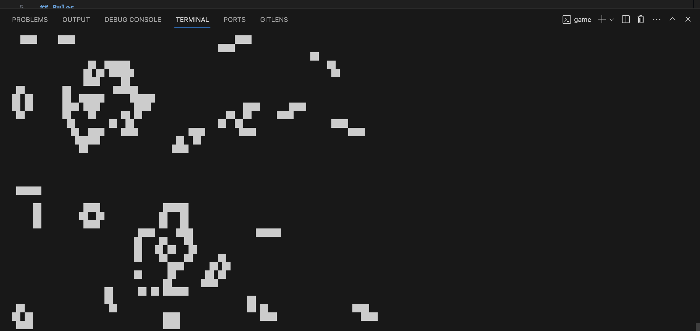

# README

This is a terminal-based implementation of Conway's Game of Life written in C. The [Game of Life](https://en.wikipedia.org/wiki/Conway%27s_Game_of_Life) is a cellular automaton that simulates the life cycle of a population of cells on a two-dimensional grid, based on a few rules.

## Rules
The rules are as follows:

1. Any live cell with fewer than two live neighbors dies, as if by underpopulation.

2. Any live cell with two or three live neighbors lives on to the next generation.

3. Any live cell with more than three live neighbors dies, as if by overpopulation.

4. Any dead cell with exactly three live neighbors becomes a live cell, as if by reproduction.

This [great video](https://www.youtube.com/watch?v=HeQX2HjkcNo) explains it and is from the great channel 'Veritasium'. The video itself is regarding a different topic and is interesting, but watch from 01:05 - 03:31 of the video to get an idea about Conway's Game of Life.

## Getting Started
To run the Game of Life simulation, follow these steps:

1. Clone the repository to your local machine:

Open your terminal (command-line) and enter the following:
`git clone https://github.com/zakmoCA/cli-conways-game-of-life.git`

2. Navigate to the project directory:

`cd cli-conways-game-of-life`

3. Compile the program by entering the following. Keep in mind 'game' can be anything you want:

`gcc -o game main.c`

4. Run the compiled program by now entering the following:

`./game`

The simulation will start running in your terminal and display the initial random grid and update it according to the Game of Life rules. The simulation will continue running until you stop it manually.

## Next Steps

I want to add functionality for the user to set the initial state themselves 
with a GUI to actually simulate the real game, as right now the initial state is random.